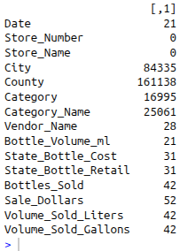
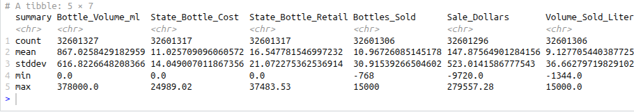
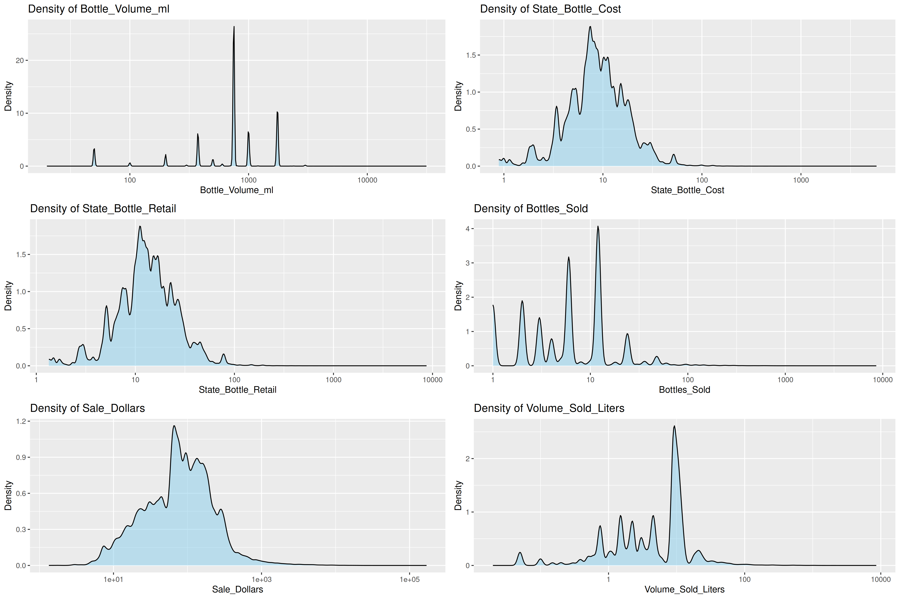
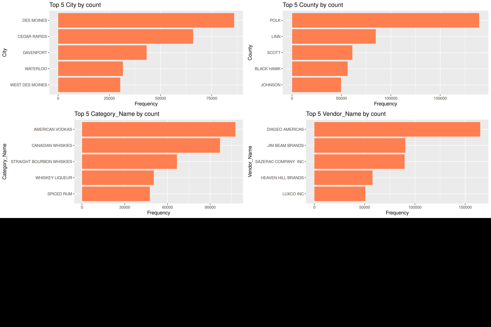
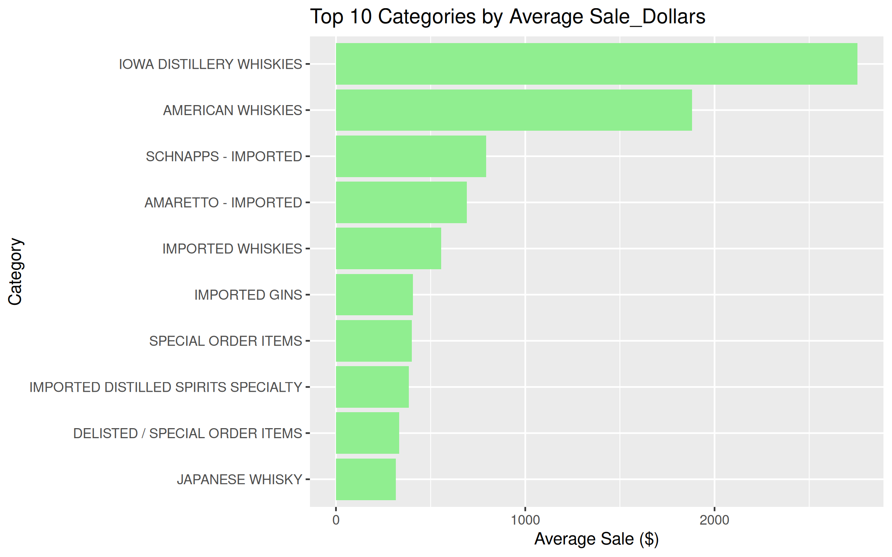
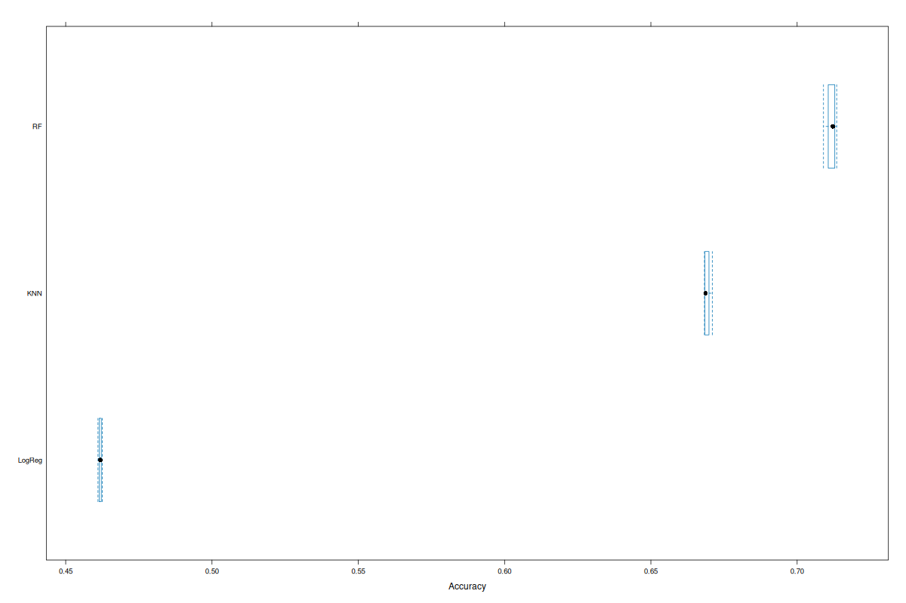
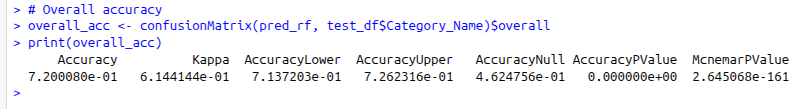
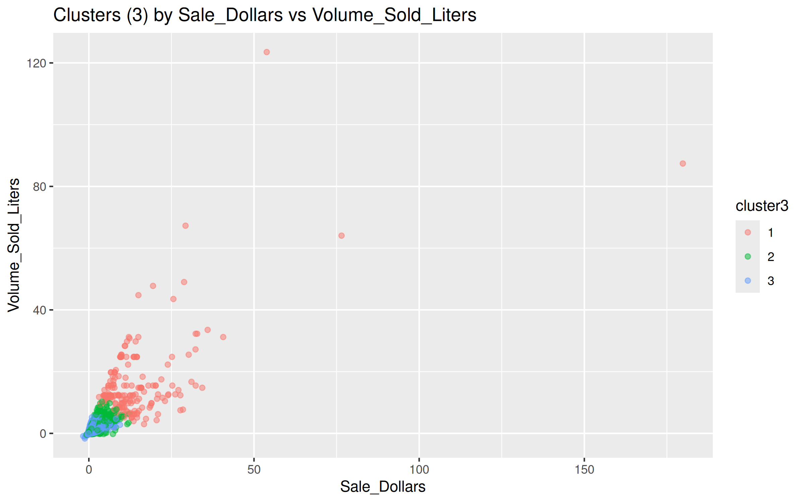
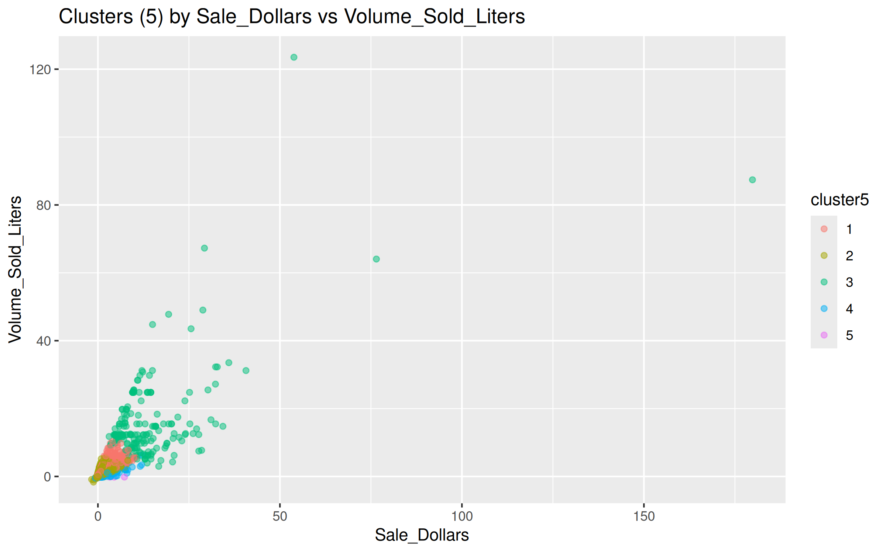

# hpc-in-ie
High Performance Computing in Information Engineering 📈
# Skup podataka

https://data.iowa.gov/Sales-Distribution/Iowa-Liquor-Sales/m3tr-qhgy/about_data
Ovaj skup podataka sadrži informacije o kupovini alkoholnih pića od strane vlasnika dozvole za prodaju alkohola klase „E” u saveznoj državi Ajova, po proizvodu i datumu kupovine, počev od 1. januara 2012. godine do danas. Korišćene tehnologije su Apache Spark i programski jezik R.

<pre>### PRIPREMA PODATAKA [3p] ###

# Upliv podataka
iowa_liquor_sales <- spark_read_csv(sc,
                             name = "iowa_liquor_sales",
                             path = "./data/iowa_liquor_sales.csv",
                             header = TRUE,
                             infer_schema = TRUE)

# Prvih 5 redova
# head(iowa_liquor_sales, 5)
# sdf_schema(iowa_liquor_sales)

# 1. red
# first_row <- iowa_liquor_sales %>% head(1) %>% collect()
# first_row_tibble <- tibble(
# Column = names(first_row),
# Value  = as.character(unlist(first_row))
# )
# print(first_row_tibble, n = Inf)

# Čišćenje podataka, kastovanje tipova i analiza prisustva nedostajućih vrednosti
iowa_clean <- iowa_liquor_sales %>%
  select(Date, Store_Number, Store_Name, City, County,
         Category, Category_Name, Vendor_Name, Bottle_Volume_ml,
         State_Bottle_Cost, State_Bottle_Retail,
         Bottles_Sold, Sale_Dollars, Volume_Sold_Liters)
head(iowa_clean, 5)

iowa_clean <- iowa_clean %>%
  mutate(Date =to_date(Date, "MM/dd/yyyy"))

head(iowa_clean, 5)
sdf_schema(iowa_clean)

iowa_clean %>% summarise(n_rows = n()) %>% collect()

missing_counts <- iowa_clean %>%
  summarise(
    across(everything(), ~sum(if_else(is.na(.), 1L, 0L)))
  ) %>%
  collect()

missing_counts_t <- t(missing_counts)
print(missing_counts_t) </pre> 

## Struktura očišćenih podataka 

| Kolona                  | Tip        |
|-------------------------|------------|
| Date                     | DateType |
| Store_Number             | IntegerType|
| Store_Name               | StringType |
| City                     | StringType |
| County                   | StringType |
| Category                 | IntegerType|
| Category_Name            | StringType |
| Vendor_Name              | StringType |
| Bottle_Volume_ml         | DoubleType |
| State_Bottle_Cost        | DoubleType |
| State_Bottle_Retail      | DoubleType |
| Bottles_Sold             | IntegerType|
| Sale_Dollars             | DoubleType |
| Volume_Sold_Liters       | DoubleType |

### Dodatno pojašnjenje: 
- **Bottle_Volume_ml** – zapremina jedne flaše u mililitrima; služi za izračunavanje ukupne količine.  
- **State_Bottle_Cost** – nabavna cena flaše koju plaća država; osnova za analizu troškova.  
- **State_Bottle_Retail** – cena koju prodavnica plaća po flaši; uvek veća od nabavne cene.  
- **Bottles_Sold** – broj prodatih flaša; indikator obima prodaje.  
- **Sale_Dollars** – ukupna vrednost prodaje u dolarima; meri finansijski učinak.  
- **Volume_Sold_Liters** – ukupna količina prodatog pića u litrima; pokazatelj obima prodaje.  

Vrednosti koje nedostaju procentualno u svojim maksimalnim pojavama nisu ni 1% ukupnog broja redova (što je preko 30 miliona).

<pre>### PRELIMINARNA ANALIZA PODATAKA [3p] ###

sdf_schema(iowa_clean)

numeric_cols <- c("Bottle_Volume_ml", "State_Bottle_Cost", "State_Bottle_Retail",
                  "Bottles_Sold", "Sale_Dollars", "Volume_Sold_Liters")

# Deskriptivne statistike
iowa_clean %>%
  select(all_of(numeric_cols)) %>%
  sdf_describe() %>% 
  collect()

# Grafici raspodele
numeric_sample <- iowa_clean %>%
  select(all_of(numeric_cols)) %>%
  sdf_sample(fraction = 1000000 / 32000000, replacement = FALSE) %>%
  collect()

make_density_plot <- function(df, col) {
  max_val <- max(df[[col]], na.rm = TRUE)
  min_val <- min(df[[col]], na.rm = TRUE)
  
    ggplot(df, aes_string(x = col)) +
      geom_density(fill = "skyblue", alpha = 0.5) +
      scale_x_log10() +
      labs(title = paste("Density of", col),
           x = col, y = "Density")

}

density_plots <- lapply(numeric_cols, function(col) make_density_plot(numeric_sample, col))
ggarrange(plotlist = density_plots, ncol = 2, nrow = 3)
ggsave("images/numeric_density_plots.png", width = 15, height = 10)

categorical_cols <- c("City", "County", "Category_Name", "Vendor_Name")

categorical_sample <- iowa_clean %>%
  select(all_of(categorical_cols)) %>%
  sdf_sample(fraction = 1000000 / 32000000, replacement = FALSE) %>%
  collect()

make_bar_plot <- function(df, col, top_n = 5) {
  
  counts <- df %>%
    count(!!sym(col), sort = TRUE) %>%
    head(top_n)
  
  ggplot(counts, aes(x = reorder(!!sym(col), n), y = n)) +
    geom_col(fill = "coral") +
    coord_flip() +
    labs(title = paste("Top", top_n, col, "by count"),
         x = col,
         y = "Frequency")
}

cat_plots <- lapply(categorical_cols, function(col) make_bar_plot(categorical_sample, col))
ggarrange(plotlist = cat_plots, ncol = 2, nrow = 3)
ggsave("images/categorical_top.png", width = 15, height = 10)

# Top 10 kategorija po prosecnoj naruzbini u dolarima
top_categories <- iowa_clean %>%
  group_by(Category_Name) %>%
  summarise(avg_sale = mean(Sale_Dollars, na.rm = TRUE)) %>%
  arrange(desc(avg_sale)) %>%
  head(10) %>%   # take top 20
  collect()
p <- ggplot(top_categories, aes(x = reorder(Category_Name, avg_sale), y = avg_sale)) +
  geom_col(fill = "lightgreen") +
  coord_flip() +
  labs(title = "Top 10 Categories by Average Sale_Dollars",
       x = "Category", y = "Average Sale ($)")

ggsave("images/top_10_categories_avg_sale.png", plot = p, width = 8, height = 5, dpi = 300) </pre> 

 
 <pre>### KLASIFIKACIJA [15] ###

iowa_clean %>%
  summarise(
    n_city = n_distinct(City),
    n_county = n_distinct(County),
    n_category = n_distinct(Category_Name),
    n_vendor = n_distinct(Vendor_Name)
  ) %>%
  collect()

sample_fraction <- 100000 / sdf_nrow(iowa_clean)

iowa_sample <- iowa_clean %>%
  sdf_sample(fraction = sample_fraction, replacement = FALSE) %>%
  collect()

predictors <- c("State_Bottle_Cost","Bottles_Sold","Sale_Dollars")

top_categories <- iowa_sample %>%
  count(Category_Name, sort = TRUE) %>%
  slice_head(n = 10) %>%
  pull(Category_Name)

print(top_categories)

df_class <- iowa_sample %>%
  select(all_of(predictors), Category_Name) %>%
  na.omit() %>%
  mutate(
    Category_Name = if_else(Category_Name %in% top_categories, 
                            Category_Name, 
                            "Other"),
    Category_Name = as.factor(Category_Name)
  )

train_index <- createDataPartition(df_class$Category_Name, p = 0.8, list = FALSE)
train_df <- df_class[train_index, ]
test_df  <- df_class[-train_index, ]

train_control <- trainControl(method = "cv", number = 3)

#REGRESIJA
model_glm <- train(
  Category_Name ~ .,
  data = train_df,
  method = "multinom",
  trControl = train_control,
  trace = FALSE
)

#RANDOM SUMA
grid_rf <- expand.grid(mtry = c(2, 3, 4))
model_rf <- train(
  Category_Name ~ .,
  data = train_df,
  method = "rf",
  tuneGrid = grid_rf,
  trControl = train_control,
  ntree = 10
)

#k-NN
grid_knn <- expand.grid(k = c(3, 5, 7))
model_knn <- train(
  Category_Name ~ .,
  data = train_df,
  method = "knn",
  tuneGrid = grid_knn,
  trControl = train_control
)

results <- resamples(list(LogReg = model_glm, RF = model_rf, KNN = model_knn))
summary(results)
p<-bwplot(results, metric = "Accuracy")
png("images/ACCURACY.png", width = 1200, height = 800)
print(p)   
dev.off()

pred_rf <- predict(model_rf, test_df)
confusionMatrix(pred_rf, test_df$Category_Name)
overall_acc <- confusionMatrix(pred_rf, test_df$Category_Name)$overall
print(overall_acc)</pre>

<pre>### KLASTERIZACIJA [6] ###
numeric_cols <- c("Bottle_Volume_ml", "State_Bottle_Cost", 
                  "State_Bottle_Retail", "Bottles_Sold", 
                  "Sale_Dollars", "Volume_Sold_Liters")

sample_fraction <- 100000 / sdf_nrow(iowa_clean)
iowa_sample <- iowa_clean %>%
  select(all_of(numeric_cols)) %>%
  sdf_sample(fraction = sample_fraction, replacement = FALSE) %>%
  collect()

iowa_scaled <- scale(iowa_sample)

# Scenario 1: 3 c
km3 <- kmeans(iowa_scaled, centers = 3, nstart = 125)

# Scenario 2: 5 c
km5 <- kmeans(iowa_scaled, centers = 5, nstart = 125)

table(km3$cluster)
table(km5$cluster)

km3$centers
km5$centers

iowa_scaled_df <- as.data.frame(iowa_scaled)
iowa_scaled_df$cluster3 <- as.factor(km3$cluster)
iowa_scaled_df$cluster5 <- as.factor(km5$cluster)

spavami <- ggplot(iowa_scaled_df, aes(x = Sale_Dollars, y = Volume_Sold_Liters, color = cluster3)) +
  geom_point(alpha = 0.5) +
  labs(title = "Clusters (3) by Sale_Dollars vs Volume_Sold_Liters")

se <- ggplot(iowa_scaled_df, aes(x = Sale_Dollars, y = Volume_Sold_Liters, color = cluster5)) +
  geom_point(alpha = 0.5) +
  labs(title = "Clusters (5) by Sale_Dollars vs Volume_Sold_Liters")

ggsave("images/spavami.png", plot = spavami, width = 8, height = 5, dpi = 300)
ggsave("images/se.png", plot = se, width = 8, height = 5, dpi = 300)

# Spark 
spark_disconnect(sc)</pre>

"May the Force be with you"

